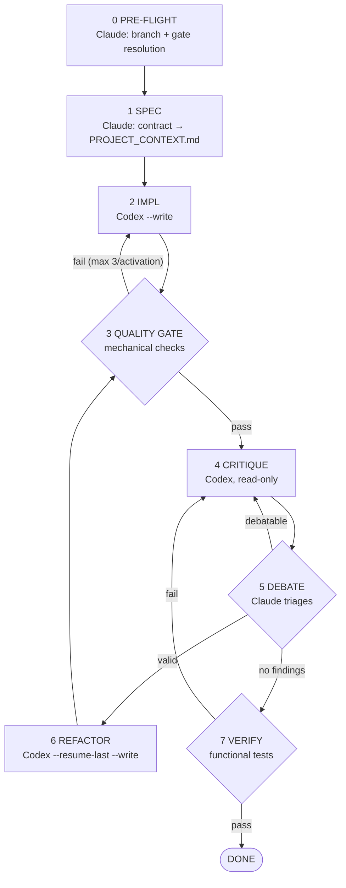
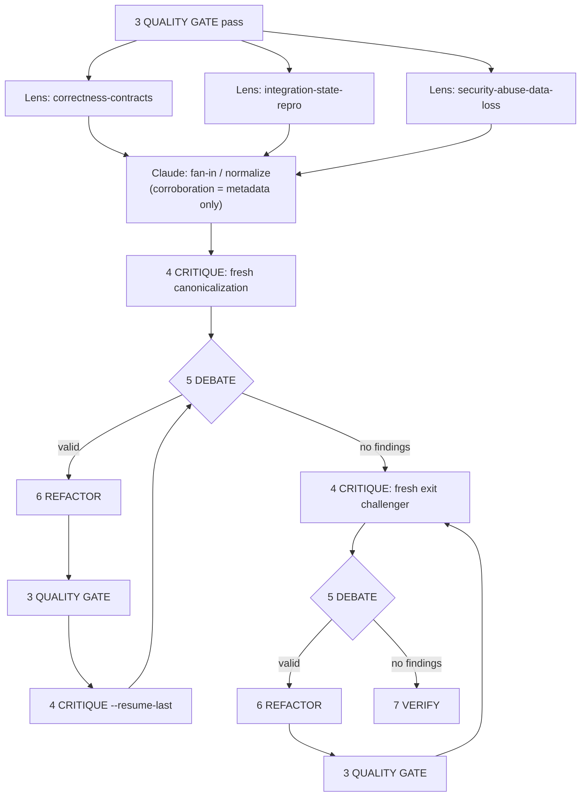

# graph-engineer

A Claude Code skill for a common problem: by default, you want a second model
(Codex) to
apply the code while Claude preserves context for orchestration and judgment,
and you don't want Codex grading its own homework without arbitration.
`graph-engineer` makes Claude the orchestrator and arbiter, and Codex the one
who writes, adversarially reviews, and fixes the code, running as a
self-correcting loop instead of a single implement-and-hope pass. The split
isn't only about token cost: it also separates roles and puts a different
model in the arbitration path.

> **Status: design-stage, adversarially reviewed, not yet dogfooded end-to-end.**
> The 8-node cycle and the QUALITY GATE resolver below converged through
> repeated Claude↔Codex adversarial review of the design itself. Neither has
> been run against a real feature in a real repository yet — treat this as
> "reviewed on paper" rather than "battle-tested." See
> [Limitations / Risks](#limitations--risks) before running `--write` against
> anything you care about.

## What is "graph engineering"?

Not an official term — no Anthropic or OpenAI product is called that. It's
useful as a mental model anyway: think of the workflow as a small graph.

- **Nodes** are units of work: Claude writing a spec, Codex implementing,
  Codex critiquing, Claude triaging.
- **Edges** are handoffs between them: spec → implementation → mechanical
  quality gate → critique → triage → fix.

What makes it a *graph* instead of a *list* is its return edges: a failed
QUALITY GATE returns to the last writer, and **VERIFY loops back to
CRITIQUE**. The latter lets the same critique step run again, and again, over
code that's already been through one round of fixes — until a stop condition
is actually met. Take those edges out and you just have a pipeline: write
once, review once, done, bugs and all.

This skill is a concrete implementation of two patterns Anthropic *does*
document officially — **Orchestrator-Workers** and **Evaluator-Optimizer**,
from
[Building Effective Agents](https://www.anthropic.com/engineering/building-effective-agents)
— nested together. See
[`skills/graph-engineer/references/sources.md`](skills/graph-engineer/references/sources.md)
for exactly what's official versus what "graph engineering" gets credited
with online but isn't.

## The cycle (8 nodes)

The cycle doesn't stop after one implement→review→fix pass — a fix can
introduce its own problems, and a first pass rarely catches everything. The
outer loop keeps going until a condition you define is verifiably true:
usually "no valid findings left, and functional tests pass."

At a glance — the state machine this skill actually runs (detailed trace
below):



Every node is Claude or Codex, never a third agent. Every edge is state
written to `PROJECT_CONTEXT.md`, not implicit memory — that's what makes
this a graph/state-machine rather than a single long conversation. Which
tool call implements each node (subagent, flags) is in the
[How it works](#how-it-works) table below.

QUALITY GATE is numbered so the invariant is visible, but it is not a new
actor or an unconditional pipeline stage: it is a capped retry edge attached
to whichever writer, IMPL or REFACTOR, just ran. CRITIQUE may run only on a
tree that has passed QUALITY GATE since the last write, or for which a
currently-valid persisted user-confirmed opt-out exists. The gate is mechanical
only (lint, formatting, type checking, and build), while VERIFY owns functional
tests and acceptance criteria. A VERIFY failure returns to CRITIQUE for
classification as an implementation defect, test defect, contract mismatch,
or environmental failure; it never takes the fast mechanical-fixer route. If
VERIFY cannot execute assertions at all because of an environmental block, the
cycle escalates directly to the user.

Before IMPL, PRE-FLIGHT resolves the project's real local quality command and
stores the resolution—not a previous result—inside the current feature's
section in `PROJECT_CONTEXT.md`. It revalidates that cached resolution after
each write. Ambiguous or unsafe candidates require one user decision; no
usable candidate stops the cycle before IMPL unless the user explicitly opts
out. See
[`skills/graph-engineer/references/quality-gate-detection.md`](skills/graph-engineer/references/quality-gate-detection.md)
for the resolver order, safety checks, cache schema, bundled-command split,
retry cap, and escalation rules.

Node 5 isn't a flat pass/fail filter — "debatable" findings open their own
small sub-loop, invisible in the 8-node diagram above:

```
[5 DEBATE]  finding classified as "debatable"
      ↓
      Claude reinjects it to codex:codex-rescue with a counterargument
      ("Codex flagged X, but Y because Z — do you stand by it or reconsider?"),
      always with --resume-last so the thread stays continuous
      ↓
      Codex replies (still read-only — no --write in this call either)
      ↓
      Claude decides: valid → refactor, or false positive → discarded
      (with written justification either way)
```

This sub-loop happens entirely inside node 5, before anything reaches node
6 — it's an extra round-trip to Codex per debatable finding, not just a
triage checkbox.

`/goal` (see [Usage](#usage)) is Claude Code's built-in stop-gate: it holds
the turn open until your success condition is verifiably true. On top of
that, the outer critique loop has two brakes for when it *isn't* converging,
and both are conditional on your `/goal` text actually including them —
neither is enforced by the skill unconditionally:

- **An anti-loop cutoff** — if, across two rounds in a row, Claude judges a
  CRITIQUE finding to be the same underlying complaint restated with no real
  change to the code, the cycle is meant to stop and escalate to you instead
  of spinning. But `/goal` binds Claude to its literal condition: this
  cutoff can only actually end the turn early if your `/goal` text itself
  includes an explicit escalation/stop clause (the templates in
  [`skills/graph-engineer/references/goal-templates.md`](skills/graph-engineer/references/goal-templates.md)
  include one — make sure yours does too). Without that clause, Claude
  remains bound by "keep working until true" and will surface the repeated
  finding rather than unilaterally stopping. Don't rely on this as an
  unconditional guarantee.
- **A recommended total CRITIQUE cap** (3 passes in the templates below) —
  unlike the anti-loop cutoff, this isn't a distinct finding-comparison
  rule; it's a plain iteration ceiling you write into `/goal` so a string of
  *different* findings can't keep the cycle going indefinitely. Same
  caveat: only as real as the clause your `/goal` text includes.

QUALITY GATE has its own separate absolute brake: no more than 3 failed runs
per writer activation. That cap never expands based on apparent progress.

Everything above is strictly sequential with return edges. The one real
fan-out/join in the whole cycle appears only when
[elevated assurance](#elevated-assurance-optional) is on, and it happens
*inside* node 4 — the node count stays 8, this is not a 9th node.

## A hypothetical worked example

This is an illustrative flow, not a transcript of an executed end-to-end run
(see the Status note above). Loosely modeled on the single-message template
— **shortened here for readability; don't copy this exact text, use the
full template in [Usage](#usage) or
[`goal-templates.md`](skills/graph-engineer/references/goal-templates.md),
which includes the CRITIQUE cap, anti-loop, QUALITY GATE, and environmental
stop clauses this shortened version omits:**
```
/goal Implement a POST /api/webhooks/verify endpoint in src/routes/webhooks.ts,
code written and fixed by Codex via graph-engineer. Stop condition: the
endpoint verifies webhook signatures and returns the documented status codes,
AND no valid findings remain from the adversarial-review. [...full template's
CRITIQUE cap, anti-loop, QUALITY GATE, and environmental clauses apply too.]
```

0. **PRE-FLIGHT** — Claude confirms the branch and worktree are safe, then
   resolves and persists the feature's mechanical quality gate.
1. **SPEC** — Claude writes the endpoint's contract (inputs, signature
   verification rule, response codes) to `PROJECT_CONTEXT.md`.
2. **IMPL** — Codex writes `webhooks.ts` following that contract.
3. **QUALITY GATE** — The resolved local lint/typecheck/build command passes
   over the newly written tree.
4. **CRITIQUE** — Codex reviews its own code adversarially and reports, say,
   two findings: *"the signature comparison uses `===` instead of a
   constant-time compare — timing attack surface"* and *"the handler doesn't
   log request IDs"*.
5. **DEBATE** — Claude reads the full security-related file before ruling,
   then triages: the timing-attack finding is **valid**, so it goes to
   refactor. The logging one is judged a **false positive** for this repo (it
   has no logging convention anywhere else) — discarded, with that reason
   written down, not silently dropped.
6. **REFACTOR** — Codex swaps in a constant-time comparison.
   - **Mini-loop:** Return to node **3 QUALITY GATE**, then node **4
     CRITIQUE** — both pass this time.
7. **VERIFY** — Functional tests run green. The `/goal` condition is met and
   the loop ends.

## Checkpointing

Long cycles — especially with elevated assurance, which can chain many
REFACTOR rounds — benefit from a restore point after every round. Claude
creates a local git commit (never pushed) after each round's mechanical
checks pass and before the next review starts, tagged `Cycle-State:
CHECKPOINT` rather than `COMPLETE` — a checkpoint only proves the tree passed
lint/type/build, not that the adversarial review or tests approved it. If a
later round goes wrong, you can revert to any prior round's checkpoint. See
`skills/graph-engineer/SKILL.md`'s QUALITY GATE node for the exact commit
format and the narrow exception this carves out of "Claude never edits
implementation files" (it covers local git metadata, never file content).

## Requirements

This skill needs the official OpenAI Codex plugin for Claude Code:
**[openai/codex-plugin-cc](https://github.com/openai/codex-plugin-cc)**.

```
/plugin marketplace add openai/codex-plugin-cc
/plugin install codex@openai-codex
/codex:setup
```

`/codex:setup` should report `Status: ready`. Also needs
[Claude Code](https://claude.com/claude-code) itself — this skill relies on
the built-in `/goal` command; confirm it's available in your installed
build, since this repository doesn't currently pin a verified Claude Code
version.

**Source-inspected against `openai-codex` plugin v1.0.6.** The routing,
flag, and sandbox assumptions (single `codex:codex-rescue` entry point,
`--write` / `--resume-last` flag behavior, sandbox enforcement of read-only
CRITIQUE calls) were checked against that version's installed plugin
sources — not exercised end-to-end (see Status above). Installing via the
commands above pulls whatever version is current, which may not be v1.0.6;
check your installed version and treat anything other than v1.0.6 as
compatibility-unverified.

## Installation

```bash
npx skills add Ranteck/graph-engineer
```

This uses the [`skills` CLI](https://www.skills.sh/) (`vercel-labs/skills`)
— an independent installer, not a Claude Code builtin. Requires Node/npm.

Or manually, after cloning this repository and from its root:
```bash
mkdir -p ~/.claude/skills
cp -R skills/graph-engineer ~/.claude/skills/
```

Before authorizing any `--write` cycle, exercise the review-only template
(see Usage below) against a disposable repository that starts with a clean
`git status`, and confirm the final `git status` still reports clean
afterward (a clean starting point is what makes that comparison meaningful).

## Choosing a mode

There are three entry paths. The cheapest costs a single Codex call and is a
complete answer for most review work, so pick deliberately rather than
defaulting to the full cycle.

Both columns are derived, not measured. **Floor** is a run where CRITIQUE
finds nothing. **One-fix round** is a run where one finding is accepted,
fixed, and re-reviewed once — the smallest run that actually does something.
Real runs with several findings cost more.

| Mode | Path | Standard Codex calls (floor / one-fix round) | Use when |
|---|---|---|---|
| **Review-only** | PRE-FLIGHT → CRITIQUE → DEBATE/report → DONE | 1 / 1 | You want an adversarial read of existing code. Never writes. |
| **Refactor-only** | PRE-FLIGHT → CRITIQUE → DEBATE → REFACTOR → QUALITY GATE → CRITIQUE → … → DONE | 1 / 3 | Existing code needs fixing, with no new feature contract involved. |
| **Full 8-node write cycle** | PRE-FLIGHT → SPEC → IMPL → … → VERIFY | 2 / 4 | New functionality that needs a contract written before the code exists. |

Review-only is 1 in both columns because it never refactors — it reports and
stops. The other two reach their one-fix number by adding REFACTOR plus the
re-review CRITIQUE after it.

On the default `codex` backend, only IMPL, CRITIQUE, and REFACTOR are Codex
calls; the other nodes are Claude.
QUALITY GATE reaches Codex only when a mechanical check fails, and DEBATE only
when a "debatable" finding is reinjected (see the
[sub-loop](#the-cycle-8-nodes) above). [Elevated
assurance](#elevated-assurance-optional) expands node 4 and adds
exit-challenger passes — it doesn't multiply IMPL or REFACTOR — and has its
own, much higher floors.

Both write-authorized paths start at PRE-FLIGHT for a reason: that's where the
clean-tree and non-`main` branch checks happen. Refactor-only does not begin
by calling Codex.

**When not to authorize a write cycle.** The question is blast radius, not
whether a change is "structural" or "cosmetic". A change that alters no
behavior, crosses no module boundary, and touches no text another file cites
as a contract hasn't earned a write cycle — read it yourself, or use
review-only. Naming isn't automatically exempt: a local variable's name has no
blast radius, but a term other files reference as a contract does, and getting
that wrong propagates silently.

### Backend selection (optional)

IMPL, CRITIQUE, and REFACTOR can opt into a different backend for one cycle by
putting `backend: codex`, `backend: claude`, or
`backend: claude:<account-alias>` in the `/goal` text or initial prompt.
Omitting the directive unconditionally keeps the existing `codex` default;
the diagrams, standard call counts, and Codex invocations elsewhere in this
README describe that default path.

This option changes only the per-cycle writer/reviewer dispatch. PRE-FLIGHT
resolves and records it, and nodes 2/4/6 apply it without changing the 8-node
cycle; see [nodes 0, 2, 4, and 6 in `SKILL.md`](skills/graph-engineer/SKILL.md#the-cycle-8-nodes)
and the detailed
[`backend-selection.md` protocol](skills/graph-engineer/references/backend-selection.md).

Honest caveat: any backend other than `codex` uses the same underlying Claude
model for writer and reviewer, so it gives up the different-model mitigation
described under [Less correlated self-review failure](#why) for that run.
DEBATE and the anti-loop cutoff still apply, but do not restore cross-model
diversity.

## Usage

**This is the write-authorized template** — it lets Codex edit files. For a
read-only audit with no edits, use the dedicated review-only template in
[`skills/graph-engineer/references/goal-templates.md`](skills/graph-engineer/references/goal-templates.md)
instead of substituting "review" into the prompt below; the two modes have
different, incompatible permissions. Review-only also isn't the 8-node cycle
running read-only — it's a separate terminal path
(`PRE-FLIGHT → CRITIQUE → DEBATE/report → DONE`) that skips SPEC, IMPL,
QUALITY GATE, REFACTOR, and VERIFY. It reviews the scope you name directly
and doesn't require a `PROJECT_CONTEXT.md` contract to exist.

```
/goal Implement [what you want] in [file/folder or scope], code written and
fixed by Codex via graph-engineer (Claude does not edit implementation files
directly). Stop condition: [your verifiable criterion] AND no valid findings
remain from the adversarial-review (debatable ones get debated, not accepted
blindly). If the cycle reaches 3 CRITIQUE passes without satisfying the stop
condition, stop and report the remaining findings instead of continuing. If
the same underlying finding is restated with no net code change across 2
consecutive CRITIQUE passes, stop and tell me instead of continuing — this
floor applies even if you'd otherwise keep going. If no usable quality-gate
resolution exists without an explicit opt-out, or one activation reaches 3
failed QUALITY GATE runs, stop and tell me instead of continuing. If
PRE-FLIGHT or SPEC's elevated-assurance risk-trigger evaluation matches and
no decision from me is available, stop before IMPL and escalate instead of
proceeding under either standard or elevated mode.
At any node, stop and report immediately on an environmental failure (timeout,
out-of-memory, read-only filesystem, or a missing command/dependency), or if
PRE-FLIGHT aborts for a dirty working tree, wrong branch, or no usable safety
precondition.
```

Prefer to review the contract before Codex is authorized to write anything?
Use the **two-message mode** instead — send a prepare-only request, review
the SPEC node's contract, then lock in the `/goal`. Full text for both
messages is in
[`goal-templates.md`, "Two-message mode"](skills/graph-engineer/references/goal-templates.md#two-message-mode-recommended-when-the-contract-is-ambiguous).

More templates (with tests, without tests, refactor-only, review-only,
elevated-assurance variants) are all in
[`skills/graph-engineer/references/goal-templates.md`](skills/graph-engineer/references/goal-templates.md).

### Elevated assurance (optional)

Standard single-thread CRITIQUE (used everywhere above) is the default for
every mode. Elevated assurance is an opt-in variant of node 4: instead of one
Codex critique thread, 3 independent fresh-thread lenses
(correctness/contracts, integration/state/reproducibility,
security/abuse/data-loss) review the implementation in parallel, Claude fans
in and normalizes their findings, and a fresh "exit challenger" pass reviews
the final artifact cold before VERIFY. It never activates by default or
silently — only on explicit request or after you confirm a matched risk
trigger (auth/crypto/payments/migrations, irreversible operations,
concurrency, public contract changes, a large diff, or a skipped QUALITY
GATE).



The 3 lenses run independently, in parallel, never seeing each other's
output — Claude is the only place they converge. The exit challenger
re-runs fresh — back to the top of that loop — every time its own findings
go through REFACTOR, until one pass finds nothing against the artifact as it
stands at that point. Only the *last* pass's "no valid findings" clears the
gate into VERIFY (or DONE in refactor-only, which has no VERIFY node).

It costs more than standard CRITIQUE: a clean run of the full 8-node write
cycle has 5 Codex review calls (3 lenses + canonicalization + exit challenger)
— 6 Codex calls total, counting IMPL. Clean refactor-only has 5 total; clean
review-only has 4 total (3 lenses + canonicalization) because it has neither
IMPL nor an exit challenger. It also consumes Claude context during fan-in.
For the risks that come with it — it is not independent verification, and
the fan-in barrier has to be ordered correctly — see
[Limitations / Risks](#limitations--risks).

Full protocol (including why the fan-in barrier is not optional ceremony)
and the ready-to-paste `/goal` templates:
- [`skills/graph-engineer/references/elevated-assurance.md`](skills/graph-engineer/references/elevated-assurance.md)
- [`skills/graph-engineer/references/goal-templates.md`](skills/graph-engineer/references/goal-templates.md)

## Why

1. **Intended token and context savings.** This split is designed to keep
   Claude's context focused on the contract, orchestration, and judgment
   while Codex carries the implementation-heavy work — not independently
   benchmarked yet. "Cheap" is relative, not free: repeated loops still
   accumulate findings and triage context. Nor does the design mean "Codex
   always implements only because it costs fewer Claude tokens": Codex is
   also routed to implementation because applying code is a role it
   performs well, independent of cost.
2. **Less correlated self-review failure (intended).** Reflection improves
   results, but a writer evaluating its own output can repeat the same
   blind spots; see Andrew Ng's
   [Agentic Design Patterns — Reflection](https://www.deeplearning.ai/the-batch/agentic-design-patterns-part-2-reflection/)
   (that source backs the general reflection pattern, not a specific claim
   about same-model self-preference bias). Claude's DEBATE arbitration adds
   a different model to the decision path instead of letting Codex apply
   every self-critique automatically. This is meant to mitigate, not
   eliminate, the risk of correlated blind spots: IMPL and CRITIQUE still
   use the same underlying Codex model.
3. **Specialization by role.** Codex writes and mechanically repairs code;
   Codex's adversarial pass challenges it; Claude owns the contract, checks
   evidence, and arbitrates disputed findings. Each role gets a narrower,
   explicit responsibility instead of one model silently switching between
   author, reviewer, and judge.

Elevated assurance deliberately trades away part of point 1 for a specific
gap in point 2: the single CRITIQUE thread's `--resume-last` continuity is
good for triage memory but can anchor it to its own earlier framing of a
REFACTOR'd fix. Closing that gap with extra fresh lenses and a cold exit
challenger is worth it only when the risk of a missed finding outweighs the
added cost, which is why it's risk-triggered rather than default.

## How it works

| Graph role | Piece | Invocation |
|---|---|---|
| Orchestrator | User + Claude Code session | — |
| Loop driver | `/goal <condition>` | built-in; `/goal clear` to reset |
| Worker (implements) | subagent `codex:codex-rescue` | `Agent` tool, `--write` |
| Mechanical gate | project-local resolved command | local shell, cached per feature |
| Evaluator (critiques) | same subagent, read-only | `Agent` tool, no `--write`, adversarial prompt |
| Fixer | same subagent, resumed | `Agent` tool, `--resume-last --write` |
| *Elevated lens sweep (opt-in)* | 3× same subagent, fresh, read-only | `Agent` tool ×3, no `--write`, `--fresh --wait`, in foreground |
| *Elevated canonical critic (opt-in)* | same subagent, fresh then resumed | `Agent` tool, `--fresh --wait` once, then `--resume-last` |
| *Elevated exit challenger (opt-in)* | same subagent, fresh, read-only, rerun until clean | `Agent` tool, no `--write`, `--fresh --wait`, gates VERIFY/DONE — reruns fresh after any REFACTOR it triggers |

Every Codex interaction goes through the single `codex:codex-rescue`
subagent — it's the only command in the plugin invocable directly by the
model (`/codex:review`, `/codex:adversarial-review`, `/codex:status`,
`/codex:result`, and `/codex:cancel` are typed-by-human-only). If you prefer
to run a review by hand instead of through the cycle, you can still type
`/codex:adversarial-review` yourself — it's just not what this skill
automates.

## Limitations / Risks

**Caveats on the claims made above:** several sections above call something
"intended," "designed to," or "hypothetical" rather than stating it as
proven — that's precision, not filler. Specifically: the worked example
above is illustrative, not an executed transcript; the token/context savings
in [Why](#why) are unverified estimates, not a benchmark; and elevated
assurance's 3 lenses give angle diversity, not independent verification (see
below). The rest of this section is where the concrete risks and unverified
claims live.

- **`--write` is destructive.** Codex edits files directly. Always run on a
  branch with a clean working tree, never on `main` with uncommitted changes.
- **Codex's cost is separate from Claude's.** This skill is designed to
  reduce Claude's context/token usage (not independently benchmarked, see
  [Why](#why)); Codex calls are billed through your own OpenAI account.
- **The overhead isn't in "calling a CLI binary."** Source-inspected in the
  pinned `openai-codex` v1.0.6 plugin: the underlying process is
  `spawn("codex", ["app-server"])` (`scripts/lib/app-server.mjs`) — a
  long-lived JSON-RPC server, not a fresh CLI exec per review. `"review"` is
  an internal job-class label used against that server, not a CLI argument.
  The real cost is **one full Codex turn per Codex node** (context, model
  reasoning) — IMPL, CRITIQUE, and REFACTOR, not all 8 nodes, since the other
  five run on Claude (see [Choosing a mode](#choosing-a-mode)) — multiplied
  across however many times the loop revisits them and, if elevated assurance
  is on, the extra lens/canonicalization/exit-challenger calls on top. That's
  where the expense actually is, not in process startup.
- **A read-only Codex session may stay read-only when resumed.** A session
  created without write access has been observed rejecting a later
  `--resume-last --write` attempt at the sandbox boundary. Recovery is to
  compare a before/after snapshot (untracked-file status, tracked diff, and
  content hashes — `git diff --check` alone doesn't prove nothing changed)
  and, only if they match, start a fresh, non-resumed Codex session with
  `--write` from the beginning instead of retrying the resume.
- **Same-model review is not independent verification.** IMPL and CRITIQUE
  both use Codex, so they can share blind spots and self-preference bias.
  Claude's evidence-based DEBATE is a mitigation, not a proof of correctness.
- **Multi-model fan-out was considered and deliberately rejected.** Having
  Claude, Codex, and other models each review independently and reconcile by
  majority vote sounds like it would buy more coverage. It was evaluated and
  rejected as the default mechanism: majority vote would discard a real
  security finding that only one reviewer happened to catch. Elevated
  assurance instead adopts angle diversity (3 lenses with different
  responsibilities) and explicitly rejects vote aggregation — cross-lens
  corroboration is recorded as metadata, never a fourth verdict. If you want
  true cross-model review, you can still drive it by hand outside this
  skill; it's just not what the automated cycle does.
- **`/goal` is a per-turn stop-gate, not a scheduler.** It keeps one turn
  alive until the condition is met; it doesn't survive closing the session.
  Some Claude Code environments offer `/loop` for unattended runs across
  turns (see the note in
  [`skills/graph-engineer/references/goal-templates.md`](skills/graph-engineer/references/goal-templates.md);
  `sources.md` only confirms turn-level persistence, not that it survives
  closing the session) — this is the highest-risk way to run this skill,
  since it authorizes unattended `--write` cycles with no human reviewing
  the contract or the findings as they happen. This project has not
  independently benchmarked or stress-tested `/loop` specifically for this
  use case.
- **The skill creates or updates `PROJECT_CONTEXT.md` in the target
  repository.** It's a real, persistent file in your repo, namespaced per
  feature — not cleaned up automatically. Review it explicitly (and decide
  whether to commit it) before wrapping up the work.
- **A checkpoint commit is not an approval.** See
  [Checkpointing](#checkpointing) above. Claude tags every one
  `Cycle-State: CHECKPOINT`, never `COMPLETE`, precisely because passing
  QUALITY GATE only proves lint/type/build passed, not that CRITIQUE or
  VERIFY signed off — a real run once tagged an intermediate round
  `COMPLETE` and needed five more REFACTOR rounds after it.
- **Elevated assurance is not independent verification.** Its 3 lenses share
  the same underlying Codex model as standard CRITIQUE, so what they add is
  angle diversity plus reduced single-thread anchoring — not a second
  opinion from a different model. A clean **elevated** run of the full 8-node
  write cycle costs 5 review calls (3 lenses + canonicalization + exit
  challenger) — 6 total counting IMPL; clean elevated refactor-only costs 5
  total, and clean elevated review-only costs 4 total. Those are elevated
  figures only; the standard floors are in
  [Choosing a mode](#choosing-a-mode). That extra cost (detailed under
  [Elevated assurance](#elevated-assurance-optional)) would undercut the
  token-savings motivation in [Why](#why) if it were ever treated as a
  default instead of a risk-triggered exception, which is why it isn't one.
  Getting the fan-in barrier ordering wrong can misdirect
  `--resume-last` to a stray lens thread instead of the intended canonical
  one — see
  [`elevated-assurance.md`](skills/graph-engineer/references/elevated-assurance.md)
  for why that barrier exists and is not optional. It must never activate
  without your explicit authorization.
- **Running the reviewer headless can look hung instead of failed.**
  User-reported, not verified by this project: if the target isn't a git
  repo, or the review process is run with stdin attached to a terminal, the
  Codex call may sit waiting on input instead of failing fast — reported
  fixes are closing stdin (`< /dev/null`) and passing `--skip-git-repo-check`
  when the target genuinely isn't a repo. Worth trying if a cycle appears
  stuck rather than erroring out.

## Feedback / bug reports

Open an issue at
[github.com/Ranteck/graph-engineer/issues](https://github.com/Ranteck/graph-engineer/issues).
Please include: your Claude Code version, the `openai-codex` plugin
version, the ecosystem/language of the target repo, the QUALITY GATE
command that got resolved (from `PROJECT_CONTEXT.md`), and sanitized
output — this skill has not been dogfooded across ecosystems yet, so
real-world reports are the fastest way to close that gap.

## License

MIT — see [LICENSE](LICENSE).
